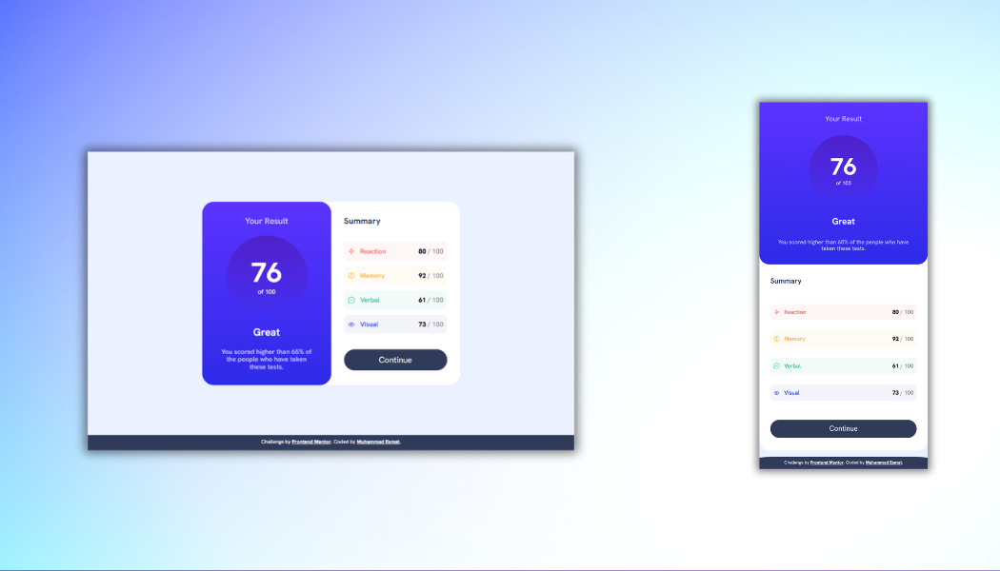

# Frontend Mentor - Results summary component solution

This is a solution to the [Results summary component challenge on Frontend Mentor](https://www.frontendmentor.io/challenges/results-summary-component-CE_K6s0maV). Frontend Mentor challenges help you improve your coding skills by building realistic projects. 

## Table of contents

- [Overview](#overview)
  - [The challenge](#the-challenge)
  - [Screenshot](#screenshot)
  - [Links](#links)
- [My process](#my-process)
  - [Built with](#built-with)
  - [What I learned](#what-i-learned)
  - [Continued development](#continued-development)
  - [Useful resources](#useful-resources)
  - [AI Collaboration](#ai-collaboration)
- [Author](#author)
- [Acknowledgments](#acknowledgments)

## Overview

### The challenge

Users should be able to:

- View the optimal layout for the interface depending on their device's screen size
- See hover and focus states for all interactive elements on the page
- **Bonus**: Use the local JSON data to dynamically populate the content

### Screenshot

### Links

- Solution URL: https://github.com/muhammad-esmat/results-component-page
- Live Site URL: https://muhammad-esmat.github.io/results-component-page/
 
## My process

### Built with

- Semantic HTML5 markup
- CSS custom properties (variables)
- Flexbox
- CSS Reset/Normalize (via normalize.css)

### What I learned

During this project, I reinforced several important CSS concepts:

1. **Modern CSS Syntax**: Discovered the difference between legacy `rgb()` and modern `rgba()` or space-separated `rgb()` with alpha channels. The invalid `rgb(100%, 100%, 100%, 60%)` syntax was a common mistake that prevented proper color rendering.

2. **CSS Naming Conventions**: Explored the evolution from simple class names to more semantic approaches. This helped me understand how to write more maintainable and scalable CSS.

3. **Semantic HTML**: Understood the importance of using proper heading elements (`<h2>`, `<h3>`) instead of `
` tags for content that represents headings, improving accessibility and document structure.

4. **CSS Custom Properties**: Gained hands-on experience with CSS variables for color management, making the stylesheet more maintainable and easier to update.

5. **Units and Viewport**: Applied `vh`, `vw`, and `dvh` units to create a responsive layout that works across different screen sizes.

7. **HSLA Colors**: Explored the use of HSLA (Hue, Saturation, Lightness, Alpha) for creating semi-transparent colors and gradients.

### Continued development

I plan to focus on:

1. **Advanced CSS Architecture**: Deepen my understanding of CSS methodologies like BEM, CSS-in-JS, and utility-first frameworks (Tailwind) to determine which works best for different project types.

2. **Performance Optimization**: Learn techniques for optimizing CSS delivery, such as critical CSS extraction, CSS code splitting, and minimizing render-blocking resources.

3. **Accessibility Mastery**: Continue improving my skills in WCAG compliance, particularly around ARIA labels, focus management, and keyboard navigation for complex components.

4. **Testing and Validation**: Implement comprehensive testing strategies for both functionality and accessibility, using tools like axe, Lighthouse, and manual testing approaches.

### Useful resources

- [MDN Web Docs - CSS Variables](https://developer.mozilla.org/en-US/docs/Web/CSS/Using_CSS_custom_properties) - This helped me understand how to implement and use CSS custom properties effectively. I really liked the clear examples and browser compatibility information.

- [MDN Web Docs - Viewport Units](https://developer.mozilla.org/en-US/docs/Learn/CSS/CSS_layout/Responsive_Design) - This helped me understand how to use `vh`, `vw`, and `dvh` units for responsive layouts.

- [MDN Web Docs - HSLA Colors](https://developer.mozilla.org/en-US/docs/Web/CSS/CSS_Colors/HSL_and_HSLA_colors) - This was incredibly useful for understanding how to work with HSLA colors and transparency.

### AI Collaboration

I used AI tools extensively throughout this project to enhance my learning and problem-solving capabilities:

**How I Used AI:**
- **Code Review**: I used AI to review my code and identify mistakes, particularly around syntax errors and best practices
- **Best Practices**: AI consistently pointed out areas where I could improve my code structure, naming conventions, and maintainability

**What Worked Well:**
- The AI was excellent at catching subtle CSS syntax errors I might have missed
- It provided clear, educational explanations that helped me understand *why* certain practices are important
- The collaborative approach accelerated my learning curve significantly

### Author

- Website - [Muhammad Esmat](https://muhammad-esmat.github.io/)
- Frontend Mentor - [@muhammad-esmat](https://www.frontendmentor.io/profile/muhammad-esmat)
- LinkedIn - [Muhammad Esmat](https://www.linkedin.com/in/muhammad-esmat/)
- GitHub - [@muhammad-esmat](https://github.com/muhammad-esmat)

### Acknowledgments

This project was made possible thanks to:

- **Frontend Mentor** — for providing such well-crafted challenges and the style guide, assets, and design files
- **Osama Elzero** — truly grateful for the great passion you put into your teaching and for making everything click so naturally
- **MDN Web Docs** — for being the definitive reference for all things web development
